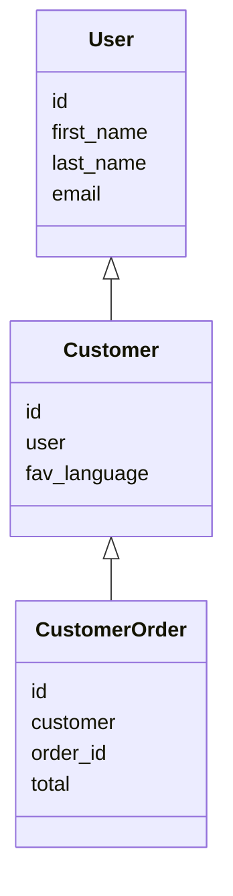

# Django Email Signals
A Django application that provides functionality to create signals via the admin panel which will send emails based on some changes to some models.

The application allows you to set your own constraints and email templates and aims to achieve this with minimal configuration.

## Installation
**Using Pip**: `pip install django-email-signals`

**Using Git**: `git clone https://github.com/Salaah01/django-email-signals.git`

## Setup
**1. Add to `INSTALLED_APPS`**
Add `ckeditor` and `email_signals` to your `INSTALLED_APPS` in your `settings.py`. This should be added after any apps which contain models for which you would like to create signals using this application.

```python
INSTALLED_APPS = [
  'app_1`,
  'app_2`,
  '...',
  'ckeditor',
  'email_signals`
]
```

**2. Run Migrations and Collect Static**
```
python manage.py migrate
python manage.py collectstatic
```

**3. Add a Default Email (Optional)**
Add `EMAIL_SIGNAL_DEFAULT_FROM_EMAIL` to your settings.
e.g: `EMAIL_SIGNAL_DEFAULT_FROM_EMAIL = 'someone@mail.com`
This will setup a default email address to send emails from should you choose not to explicitly set one when creating signals.

**4. Add the Model Mixin**
On the models that you want to raise signals, you will need to add the following mixin as a dependency to the models: `email_signals.models.EmailSignalMixin`.

Example:
Let's suppose you have the following model.
```python
from django.db import models

class Customer(models.Model):
    name = models.CharField(max_length=200, null=True)
    email = models.CharField(max_length=200)
```
You would need to change this model to the following:

```python
from email_signals.models import EmailSignalMixin

class Customer(models.Model, EmailSignalMixin):
    name = models.CharField(max_length=200, null=True)
    email = models.CharField(max_length=200)
```

**5. Add Recipients**
Depending on the change to the data, you may want to send an email to different people. We facilitate this by setting up the various possible mailing lists into the model itself. This one is easier to show first then explain:

```python
from email_signals.models import EmailSignalMixin

class Customer(models.Model, EmailSignalMixin):
    name = models.CharField(max_length=200, null=True)
    email = models.CharField(max_length=200)

    def get_email_signal_emails_1(self):
        """Recipient is the customer."""
        return [self.email]
    
    def get_email_signal_emails_2(self):
        """Recipient list includes management."""
        return ['manager@somewhere.com', 'supervisor@somewhere.com']
```

Notice that we have two functions, each function starts with "get_email_signal_emails_" and then a positive integer. Each of these functions return a mailing list and we can create as many of these as we need (unless you have to need more than 2,147,483,647 mailing lists). Later on, when we setup the signals, we will need to enter a positive integer to indicate which mailing list to choose when sending an email.

## Adding Signals
Now that the setup is complete, signals can be added via the admin (or by updating the database directly).

We will imagine I am running a site on localhost and so the admin panel can be found by navigating to http://localhost:8000/admin/. The signals can then be accessed by navigating to http://localhost:8000/admin/email_signals/signal/. We will start by adding some signals. Click on "add signal" to get started.

A wise man taught me *it's better to sound silly for a moment than not know something and feel stupid forever*. So, in that vein, though it might seem obvious, we'll go through the options in the form and discuss what each option
is responsible for.

| Field Label      | Field Name       | Description                                                                                                                    |
| ---------------- | ---------------- | ------------------------------------------------------------------------------------------------------------------------------ |
| Name             | name             | An name for your signal, just to make it easier to distinguish from other records.                                             |
| Description      | description      | (Optional) Description for your signal.                                                                                        |
| Model (Table)    | content_type     | The model which this signal relates to.                                                                                        |
| Plain text email | plain_text_email | (Optional) Plain text email to send.                                                                                           |
| HTML email       | html_email       | (Optional) HTML email to send.                                                                                                 |
| Subject          | subject          | Email subject                                                                                                                  |
| From email       | from_email       | (Optional) The email sender. Defaults to `settings.EMAIL_SIGNAL_DEFAULT_FROM_EMAIL`.                                           |
| Mailing list no  | to_emails_opt    | The recipient list where the integer you enter (i), corresponds to a method called `get_email_signal_emails_<i>` in the model. |
| Template         | template         | (Optional) Path to a template, should you wish to render an email from a template.                                             |
| Signal Type      | signal_type      | Type of signal to raise for this record.                                                                                       |
| Active           | active           | A switch to turn this signal on and off.                                                                                       |

**Signal Constraints**
This inline model is where you can set some constraints which will determine if the signal should be raised on a case by case basis.

| Field Label | Field Name | Description                                                                                                                                                                                                                                                                                                                                                                                                                                  |
| ----------- | ---------- | -------------------------------------------------------------------------------------------------------------------------------------------------------------------------------------------------------------------------------------------------------------------------------------------------------------------------------------------------------------------------------------------------------------------------------------------- |
| Parameter 1 | param_1    | The first parameter to use when testing a constraint. This parameter must exist in the signal kwargs or the model instance.                                                                                                                                                                                                                                                                                                                  |
| Comparison  | comparison | Define how to compare the parameters. E.g: parameter 1 is **greater than** parameter 2.                                                                                                                                                                                                                                                                                                                                                      |
| Parameter 1 | param_1    | (Optional) The second parameter to use when testing a constraint. This parameter can be left empty when the constraint is something sensible. For example, if constraint is "Is True" then there is no need for parameter 2. But if the constraint is, "Greater Than", then parameter 2 is needed. Parameter 2 can also be a primitive type such as 'a', '1', '1.1'. The application will attempt to convert strings into numbers if it can. |

**Parameters are Deep**
Both parameters 1 and 2 allow you to search deep inside an object.
Let's suppose we have the following structure and signal has received a `CustomerOrder` instance.



Given a `CustomerOrder` instance (we'll call this variable `order`), we can set the following in our constraints:

| \#  | Parameter 1                  | Comparison   | Parameter 2                 |
| --- | ---------------------------- | ------------ | --------------------------- |
| 1   | `'customer.user.id'`         | Greater Than | `'5'`                       |
| 2   | `'customer.user.first_name'` | Equal To     | `'customer.user.last_name'` |

Constraint 1 will check the following:
```python
order.customer.user.id > 5
```
Similarly, constraint 2 will check the following:
```python
order.customer.user.first_name == order.customer.user.last_name
```

Only when all constraints are satisfied will the email be sent.

## Playground
The repository comes with an example project to get you started. If you prefer to test this application yourself then I recommend cloning the repository.

Navigating to `example` and running the Django project inside.
