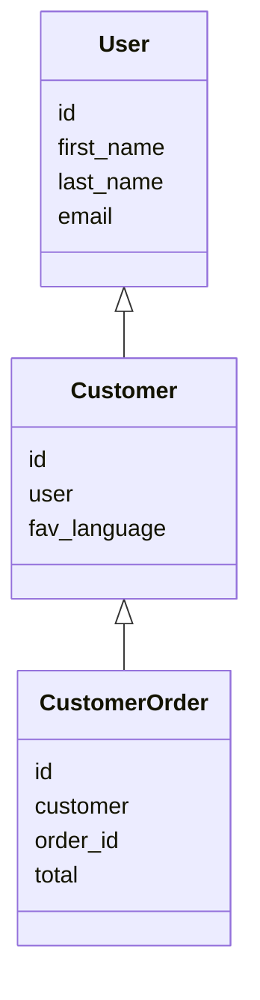

# Django Email Signals
A Django application that provides functionality to create signals via the admin panel which will send emails based on some changes to some models.

The application allows you to set your own constraints and email templates and aims to achieve this with minimal configuration.

# Use Cases
**Admins are able to setup signals/emails themselves**

If an admin user has requested for an email to be sent when something happens on the database, what do we do? We developers create a new signal, set any constraints, create the email templates, piece everything together, create unit tests and then deploy. Relatively simple, but still time-consuming especially when there are multiple signals to set up for various changes. This quickly becomes a quite lengthy process.

This application aims to solve this by providing a way for admins to create these signals themselves rather than having to request the feature and wait for deployment. This is a great way to ease the pressure off developers whilst giving admins the ability to get results quickly.

*How would an admin know what fields to enter for the params?*
The application validates the form before saving but also provides autocomplete for the fields.

**Quickly prototyping and testing an email template**

Creating and testing templates for some bigger teams can be a time-consuming process. This is particularly true when the request is from someone who for whatever reason cannot view your screen and relies on you deploying to a test environment to be able to test the template.

The process then can become a bit tedious. Ever been in a scenario where you deploy some code to test, have it reviewed, have to tweak some code, redeploy it, and have the process repeated a few times?

This application aims to solve this by providing a way for admins to create the HTML content themselves using a rich text editor. This allows admins to quickly prototype and test the email content themselves. Once ready, all they need to do is click on "show source code", and send that sweet source code to you.

## Installation
To install the application, run the following command:
```
pip install django-email-signals
```

The pip install command will be all that is required for most people, however if you want to look under the hood and see what's going on, you can clone the source directory:
```
git clone https://github.com/Salaah01/django-email-signals.git
```

## Setup
**1. Add to `INSTALLED_APPS`**
i. Add Add `ckeditor` to your `INSTALLED_APPS` in your `settings.py` file.

```python
INSTALLED_APPS = [
  'app_1`,
  'app_2`,
  '...',
  'ckeditor',
]
```

ii. Add Add `email_signals` to your `INSTALLED_APPS` in your `settings.py` file. This should be added after any apps which contain models for which you would like to create signals using this application.

```python
INSTALLED_APPS = [
  'app_1`,
  'app_2`,
  '...',
  'ckeditor',
  'email_signals`
]
```

**2. Run Migrations and Collect Static**
```
python manage.py migrate
python manage.py collectstatic
```

**3. Update URLs (Option)**
Update your root `urls.py` file to include the following:
```python
from django.urls import include

url_patterns = [
  path('email-signals/', include('email_signals.urls')),
]
```
We recommend changing the URL to something a bit harder to guess, just to make life harder for those pesky snoopers. The application paths all require the user to be a staff member to be able to access the links.

Though this step is optional, we recommend doing it as it will make setting constraints in the admin area much easier. The URLs are needed to provide a dropdown with options when building your constraints.

**4. Add a Default Email (Optional)**
Add `EMAIL_SIGNAL_DEFAULT_SENDER` to your settings.
e.g: `EMAIL_SIGNAL_DEFAULT_SENDER = 'someone@mail.com`
If you don't want to explicitly specify a sender email for every signal you define, you can set `EMAIL_SIGNAL_DEFAULT_SENDER` in your project `settings.py`.

**5. Add the Model Mixin**
On the models that you want to raise signals, you will need to add the following mixin as a dependency to the models: `email_signals.models.EmailSignalMixin`.

Example:
Let's suppose you have the following model.
```python
from django.db import models

class Customer(models.Model):
    name = models.CharField(max_length=200, null=True)
    email = models.CharField(max_length=200)
```
You would need to change this model to the following:

```python
from email_signals.models import EmailSignalMixin

class Customer(models.Model, EmailSignalMixin):
    name = models.CharField(max_length=200, null=True)
    email = models.CharField(max_length=200)
```

**6. Add Recipients**
Depending on the change to the data, you may want to send an email to different people. We facilitate this by setting up the various possible mailing lists into the model itself. This one is easier to show first then explain:

```python
from email_signals.models import EmailSignalMixin

class Customer(models.Model, EmailSignalMixin):
    name = models.CharField(max_length=200, null=True)
    email = models.CharField(max_length=200)

    def customer_emails(self):
        """Recipient is the customer."""
        return [self.email]
    
    def management_mailing_list(self):
        """Recipient list includes management."""
        return ['manager@somewhere.com', 'supervisor@somewhere.com']
```

We've created two functions called `customer_emails` and `management_mailing_list` which each return a collection of email addresses. Later on, when we setup the signals, we will be asked to set the mailing list to use for each signal. This is where we would enter our function names ``customer_emails` or `management_mailing_list`.

This therefore, allows us to set up different mailing lists within our models.
## Adding Signals
Now that the setup is complete, signals can be added via the admin (or by updating the database directly).

We will imagine I am running a site on localhost and so the admin panel can be found by navigating to http://localhost:8000/admin/. The signals can then be accessed by navigating to http://localhost:8000/admin/email_signals/signal/. We will start by adding some signals. Click on "add signal" to get started.

A wise man taught me *it's better to sound silly for a moment than not know something and feel stupid forever*. So, in that vein, though it might seem obvious, we'll go through the options in the form and discuss what each option
is responsible for.

| Field Label      | Field Name       | Description                                                                                                                    |
| ---------------- | ---------------- | ------------------------------------------------------------------------------------------------------------------------------ |
| Name             | name             | An name for your signal, just to make it easier to distinguish from other records.                                             |
| Description      | description      | (Optional) Description for your signal.                                                                                        |
| Model (Table)    | content_type     | Choose from the drop down the model this signal relates to.                                                                                        |
| Plain text content | plain_message | (Optional) Plain text email to send.                                                                                           |
| HTML content       | html_message       | (Optional) HTML email to send.                                                                                                 |
| Subject          | subject          | Email subject                                                                                                                  |
| From email       | from_email       | (Optional) The email sender. Defaults to `settings.EMAIL_SIGNAL_DEFAULT_SENDER`.                                           |
| Mailing list  | mailing_list    | The recipient list where the text you enter, corresponds to a method called in the model class with the same name. e.g: If you enter `customer_mails`, then there will need to be a method called `customer_mails` that returns a collection of emails in the model class. |
| Template         | template         | (Optional) Path to a template, should you wish to render an email from a template. This uses Django's template loader, so as the value you provide here should be relative to `settings.TEMPLATES[i]['DIRS']`.                                             |
| Signal Type      | signal_type      | Type of signal to raise for this record.                                                                                       |
| Active           | active           | A switch to turn this signal on and off.                                                                                       |

**Signal Constraints**
This inline model is where you can set some constraints which will determine if the signal should be raised on a case by case basis.

| Field Label | Field Name | Description                                                                                                                                                                                                                                                                                                                                                                                                                                  |
| ----------- | ---------- | -------------------------------------------------------------------------------------------------------------------------------------------------------------------------------------------------------------------------------------------------------------------------------------------------------------------------------------------------------------------------------------------------------------------------------------------- |
| Parameter 1 | param_1    | The first parameter to use when testing a constraint. This parameter must exist in the signal kwargs or the model instance.                                                                                                                                                                                                                                                                                                                  |
| Comparison  | comparison | Define how to compare the parameters. E.g: parameter 1 is **greater than** parameter 2.                                                                                                                                                                                                                                                                                                                                                      |
| Parameter 1 | param_1    | (Optional) The second parameter to use when testing a constraint. This parameter can be left empty when the constraint is something sensible. For example, if constraint is "Is True" then there is no need for parameter 2. But if the constraint is, "Greater Than", then parameter 2 is needed. Parameter 2 can also be a primitive type such as 'a', '1', '1.1'. The application will attempt to convert strings into numbers if it can. |

**Parameters are Deep**
Both parameters 1 and 2 allow you to search deep inside an object.
Let's suppose we have the following structure and signal has received a `CustomerOrder` instance.



Given a `CustomerOrder` instance (we'll call this variable `order`), we can set the following in our constraints:

| \#  | Parameter 1                  | Comparison   | Parameter 2                 |
| --- | ---------------------------- | ------------ | --------------------------- |
| 1   | `'customer.user.id'`         | Greater Than | `'5'`                       |
| 2   | `'customer.user.first_name'` | Equal To     | `'customer.user.last_name'` |

Constraint 1 will check the following:
```python
order.customer.user.id > 5
```
Similarly, constraint 2 will check the following:
```python
order.customer.user.first_name == order.customer.user.last_name
```

Only when all constraints are satisfied will the email be sent.

## Playground
The repository comes with an example project to get you started. If you prefer to test this application yourself then I recommend cloning the repository.

Navigating to `example` and running the Django project inside.


## Testing
In the root of the project there is a `runtests.py` file which can be used to run the tests.
